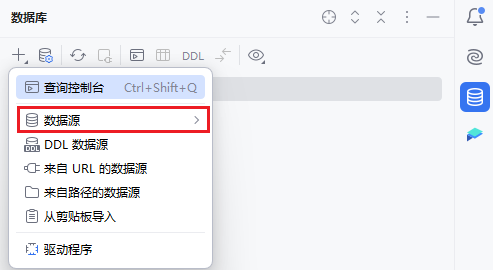
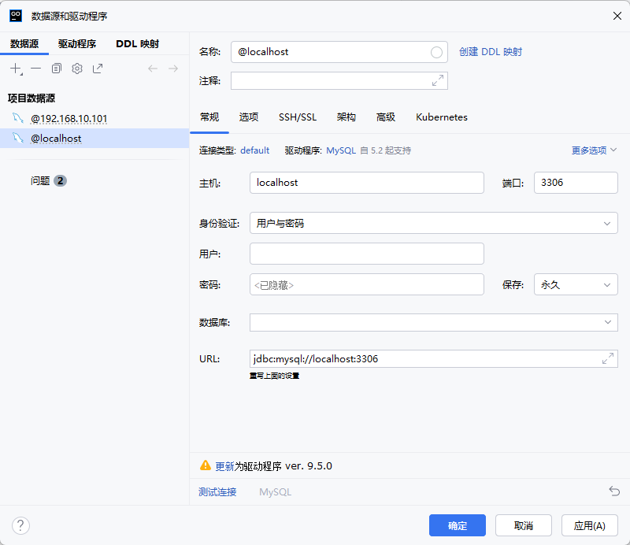
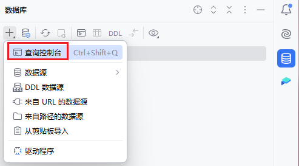
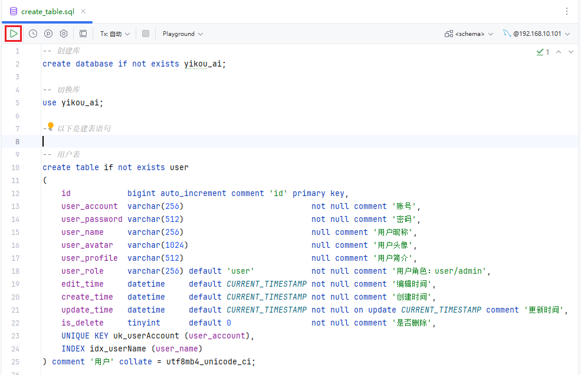
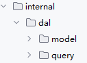
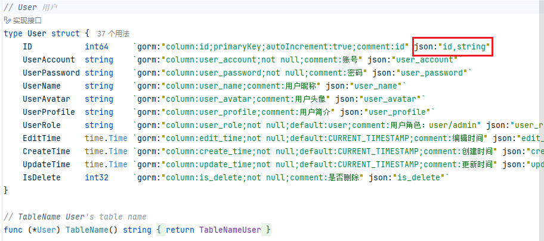
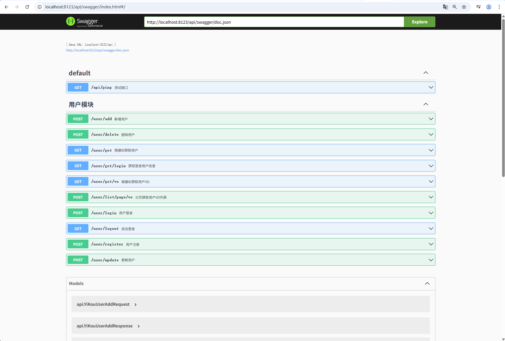

# 第2章：后端项目用户模块搭建

> 本章目标：掌握使用 go-wire 进行依赖注入，搭建用户模块的完整架构

## 本章概述

恭喜你进入第二章！在这一章，我们将学习如何使用 Google 的 go-wire 工具进行依赖注入，搭建一个完整的用户模块。依赖注入是构建大型企业级项目的关键技术，能帮助你写出更清晰、更易测试的代码。

## 知识点清单

### 一、go-wire 前提准备

#### 1. 什么是 go-wire？

**go-wire 简介：**

go-wire 是 Google 开源的一个 Go 语言**依赖注入代码生成工具**。它通过编译时代码生成的方式，自动处理组件之间的依赖关系。

**核心特点：**

- **编译时生成**：在编译时生成依赖注入代码，而非运行时反射
- **类型安全**：编译时检查依赖关系，避免运行时错误
- **性能优异**：生成的代码性能接近手写代码
- **简单易用**：通过简单的配置即可自动生成复杂的初始化代码

#### 2. 为什么需要依赖注入？

**问题场景：手动管理依赖**

假设我们有以下结构：

```go
// 用户处理器
type UserHandler struct {
    userService *UserService
}

// 用户服务
type UserService struct {
    userRepo *UserRepository
}

// 用户仓储
type UserRepository struct {
    db *gorm.DB
}

// 传统方式：手动创建依赖
func main() {
    // 1. 创建数据库连接
    db, _ := gorm.Open(mysql.Open(dsn), &gorm.Config{})
  
    // 2. 创建仓储
    userRepo := &UserRepository{db: db}
  
    // 3. 创建服务
    userService := &UserService{userRepo: userRepo}
  
    // 4. 创建处理器
    userHandler := &UserHandler{userService: userService}
  
    // 使用处理器...
}
```

**存在的问题：**

- **依赖关系复杂**：需要手动管理创建顺序
- **代码重复**：每个地方都需要重复创建逻辑
- **难以测试**：无法轻松替换依赖进行测试
- **维护困难**：修改依赖关系需要改动多处代码

**解决方案：使用 go-wire**

```go
// wire.go
//+build wireinject

package main

import "github.com/google/wire"

func InitializeUserHandler(db *gorm.DB) *UserHandler {
    wire.Build(
        NewUserRepository,
        NewUserService,
        NewUserHandler,
    )
    return nil
}

// wire_gen.go (自动生成)
func InitializeUserHandler(db *gorm.DB) *UserHandler {
    userRepository := NewUserRepository(db)
    userService := NewUserService(userRepository)
    userHandler := NewUserHandler(userService)
    return userHandler
}
```

**优势：**

- **自动管理依赖**：wire 自动分析依赖关系
- **类型安全**：编译时检查依赖是否完整
- **易于测试**：可以轻松替换依赖实现
- **代码清晰**：依赖关系一目了然

#### 3. 安装 go-wire

**在项目中添加依赖：**

```bash
# 添加 wire 依赖到 go.mod
go get github.com/google/wire
```

**安装 wire 命令行工具：**

```bash
# 安装 wire
go get github.com/google/wire/cmd/wire
# 验证安装
wire version
```

#### 4. go-wire 核心概念

**Provider（提供者）：**

Provider 是一个可以产生值的函数，用于创建依赖对象。

```go
// Provider 示例

// 简单的 Provider
func NewDB() (*gorm.DB, error) {
    return gorm.Open(mysql.Open(dsn), &gorm.Config{})
}

// 带依赖的 Provider
func NewUserRepository(db *gorm.DB) *UserRepository {
    return &UserRepository{db: db}
}

// 带清理函数的 Provider
func NewRedis() (*redis.Client, func(), error) {
    client := redis.NewClient(opts)
    cleanup := func() { client.Close() }
    return client, cleanup, nil
}
```

**Injector（注入器）：**

Injector 是一个声明依赖关系的函数，wire 会根据它生成实际的初始化代码。

```go
//+build wireinject

package main

import "github.com/google/wire"

// Injector 函数声明
func InitializeApp() (*App, func(), error) {
    wire.Build(
        NewDB,           // 提供 *gorm.DB
        NewUserRepo,     // 需要 *gorm.DB，提供 *UserRepository
        NewUserService,  // 需要 *UserRepository，提供 *UserService
        NewApp,          // 需要 *UserService，提供 *App
    )
    // 以下代码省略
    ......
}
```

**WireSet（依赖集合）：**

WireSet 用于将一组相关的 Provider 组合在一起。

```go
// 定义 User 模块的 Provider Set
var UserSet = wire.NewSet(
    NewUserRepository,
    NewUserService,
    NewUserHandler,
)

// 定义数据库的 Provider Set
var DBSet = wire.NewSet(
    NewDB,
    NewRedis,
)

// 在 Injector 中使用
func InitializeApp() (*App, error) {
    wire.Build(
        DBSet,    // 数据库相关
        UserSet,  // 用户模块相关
        NewApp,
    )
    // 以下代码省略
    ......
}
```

#### 5. go-wire 使用流程

**完整的使用流程：**

```
1. 定义 Provider 函数
   ↓
2. 创建 Injector 函数（添加 wire.Build）
   ↓
3. 运行 wire 命令生成代码
   ↓
4. 使用生成的初始化函数
```

#### 6. go-wire 最佳实践

**1. Provider 命名规范**

```go
// ✅ 推荐：使用 New 前缀
func NewUserRepository(db *gorm.DB) *UserRepository
func NewUserService(repo *UserRepository) *UserService
func NewUserHandler(service *UserService) *UserHandler

// ❌ 不推荐：其他命名
func CreateUserRepository(db *gorm.DB) *UserRepository
func GetUserRepository(db *gorm.DB) *UserRepository
```

**2. 使用 WireSet 组织依赖**

```go
// internal/repository/wire.go
package repository

import "github.com/google/wire"

var RepositorySet = wire.NewSet(
    NewUserRepository,
    NewChatRepository,
    NewMessageRepository,
)

// internal/service/wire.go
package service

import "github.com/google/wire"

var ServiceSet = wire.NewSet(
    NewUserService,
    NewChatService,
    NewMessageService,
)

// cmd/wire.go
func InitializeApp() (*App, error) {
    wire.Build(
        repository.RepositorySet,
        service.ServiceSet,
        handler.HandlerSet,
        NewApp,
    )
    return nil
}
```

**3. 接口与实现分离**

```go
// 定义接口
type IUserService interface {
    GetUser(id int) (*User, error)
    CreateUser(user *User) error
}

// 实现接口
type UserService struct {
    repo IUserRepository
}

// Provider 返回接口类型
func NewUserService(repo IUserRepository) IUserService {
    return &UserService{repo: repo}
}
```

**4. 错误处理**

```go
// Provider 可以返回 error
func NewDB(cfg *config.Config) (*gorm.DB, error) {
    db, err := gorm.Open(mysql.Open(cfg.DSN), &gorm.Config{})
    if err != nil {
        return nil, fmt.Errorf("failed to connect database: %w", err)
    }
    return db, nil
}

// Injector 也会返回 error
func InitializeApp() (*App, error) {
    wire.Build(
        NewDB,
        NewApp,
    )
    return nil
}
```

### 二、用户模块架构设计

在完成了 go-wire 的学习之后，我们现在开始搭建用户模块。架构设计的第一步是**数据库表方案设计**，这是整个模块的基础。

#### 1. 数据库设计原则

**企业级项目数据库设计原则：**

1. **命名规范**

   - 表名：使用小写字母，单词间用下划线分隔（如 `user`, `chat_message`）
   - 字段名：使用小写字母，单词间用下划线分隔（如 `user_name`, `create_time`）
   - 索引名：使用前缀标识类型（如 `uk_` 唯一索引，`idx_` 普通索引）
2. **字段设计规范**

   - 主键：使用 `bigint` 自增，便于分库分表
   - 时间字段：统一使用 `datetime` 类型
   - 状态字段：使用 `tinyint` 类型
   - 字符串：根据实际需求选择合适的长度
   - 必须字段：添加 `not null` 约束
3. **索引设计原则**

   - 为查询频繁的字段添加索引
   - 唯一约束字段添加唯一索引
   - 避免过多索引影响写入性能
   - 联合索引遵循最左前缀原则
4. **通用字段设计**

   - `id`：主键，bigint 自增
   - `create_time`：创建时间，自动设置
   - `update_time`：更新时间，自动更新
   - `is_delete`：逻辑删除标识，0-未删除，1-已删除

#### 2. 用户表设计方案

**用户表结构设计：**

```sql
-- 创建库
create database if not exists yikou_ai;

-- 切换库
use yikou_ai;

-- 用户表
create table if not exists user
(
    id            bigint auto_increment comment 'id' primary key,
    user_account  varchar(256)                           not null comment '账号',
    user_password varchar(512)                           not null comment '密码',
    user_name     varchar(256)                           null comment '用户昵称',
    user_avatar   varchar(1024)                          null comment '用户头像',
    user_profile  varchar(512)                           null comment '用户简介',
    user_role     varchar(256) default 'user'            not null comment '用户角色：user/admin',
    edit_time     datetime     default CURRENT_TIMESTAMP not null comment '编辑时间',
    create_time   datetime     default CURRENT_TIMESTAMP not null comment '创建时间',
    update_time   datetime     default CURRENT_TIMESTAMP not null on update CURRENT_TIMESTAMP comment '更新时间',
    is_delete     tinyint      default 0                 not null comment '是否删除',
    UNIQUE KEY uk_userAccount (user_account),
    INDEX idx_userName (user_name)
) comment '用户' collate = utf8mb4_unicode_ci;
```

#### 3. 字段详细说明

**字段设计详解：**

| 字段名            | 类型          | 约束                        | 默认值            | 说明         | 设计理由                               |
| ----------------- | ------------- | --------------------------- | ----------------- | ------------ | -------------------------------------- |
| `id`            | bigint        | PRIMARY KEY, AUTO_INCREMENT | -                 | 主键ID       | 使用 bigint 支持大数据量，便于分库分表 |
| `user_account`  | varchar(256)  | NOT NULL, UNIQUE            | -                 | 用户账号     | 唯一约束保证账号不重复，256长度足够    |
| `user_password` | varchar(512)  | NOT NULL                    | -                 | 用户密码     | 512长度支持加密后的密码存储            |
| `user_name`     | varchar(256)  | NULL                        | -                 | 用户昵称     | 允许为空，用户可以不设置昵称           |
| `user_avatar`   | varchar(1024) | NULL                        | -                 | 用户头像URL  | 存储头像图片的URL地址                  |
| `user_profile`  | varchar(512)  | NULL                        | -                 | 用户简介     | 用户个人简介，可选字段                 |
| `user_role`     | varchar(256)  | NOT NULL                    | 'user'            | 用户角色     | 默认普通用户，支持扩展更多角色         |
| `edit_time`     | datetime      | NOT NULL                    | CURRENT_TIMESTAMP | 编辑时间     | 记录最后编辑时间                       |
| `create_time`   | datetime      | NOT NULL                    | CURRENT_TIMESTAMP | 创建时间     | 自动设置为当前时间                     |
| `update_time`   | datetime      | NOT NULL                    | CURRENT_TIMESTAMP | 更新时间     | 自动更新为当前时间                     |
| `is_delete`     | tinyint       | NOT NULL                    | 0                 | 逻辑删除标识 | 0-未删除，1-已删除                     |

#### 4. 索引设计说明

**索引设计详解：**

```sql
-- 主键索引（自动创建）
PRIMARY KEY (id)

-- 唯一索引：保证账号唯一性
UNIQUE KEY uk_userAccount (user_account)

-- 普通索引：加速按昵称查询
INDEX idx_userName (user_name)
```

在数据库可视化界面、本地命令行执行以上创建表的sql语句，或者在GoLand连接到自己的MySQL数据库，新建查询控制台执行sql语句（推荐），因为在后续步骤中，将代码开发集中在ide中可以提高项目的开发效率









**建议：作为一位优秀的程序员，务必将sql表设计文件保存到项目的目录中，例如 `/sql/create_table.sql`，便于团队的其他开发者更快地了解整个项目的设计架构**

### 三、开始后端用户模块开发

在完成了 go-wire 的学习和数据库表设计之后，我们现在开始实际开发用户模块。第一步是**搭建依赖注入架构**，这是整个项目的基础框架。

#### 1. 项目依赖注入架构设计

**依赖关系图：**

```
Config (配置)
  ↓
Server (服务器)
  ↓
Router (路由)
  ↓
Handler (处理器)
  ↓
Service (业务逻辑)
  ↓
Db (数据访问)
```

#### 2. 创建配置初始化 Provider

**配置结构体设计：**

修改 `config/config.go` 文件的InitConfig方法：

```go
// InitConfig 初始化配置 - 这是一个 Provider 函数
// env 参数用于指定配置文件后缀，如 "local" 会读取 config-local.yaml
func InitConfig() *Config {
	// 解析命令行参数
	env := flag.String("env", "", "运行环境，如 local, dev, test, prod")
	flag.Parse()

	// 获取项目根路径
	rootPath, err := GetProjectRootPath()
	if err != nil {
		panic(fmt.Errorf("获取项目根路径失败: %w", err))
	}

	// 拼接配置文件目录路径
	configPath := filepath.Join(rootPath, "config")

	// 确定配置文件名称
	configName := "config"
	if *env != "" {
		configName = fmt.Sprintf("config-%s", *env)
	}

	// 设置配置文件名和路径
	viper.SetConfigName(configName) // 配置文件名称
	viper.SetConfigType("yml")      // 配置文件类型
	viper.AddConfigPath(configPath) // 配置文件路径

	// 读取环境变量
	viper.AutomaticEnv()

	// 读取配置文件
	if err := viper.ReadInConfig(); err != nil {
		panic(fmt.Errorf("读取配置文件失败: %w", err))
	}

	// 解析配置到结构体
	cfg := &Config{}
	if err := viper.Unmarshal(cfg); err != nil {
		panic(fmt.Errorf("解析配置失败: %w", err))
	}
	return cfg
}
```

#### 3. 创建 Wire 依赖注入配置

**创建 wire 目录和文件：**

创建 `wire/wire.go` 文件：

```go
//go:build wireinject
package wire

import (
	"fmt"
	"strconv"

	"github.com/cloudwego/hertz/pkg/app/server"
	"github.com/google/wire"
	"github.com/hertz-contrib/swagger"

	"yikou-ai-go-teach/config"
	"yikou-ai-go-teach/docs"
	"yikou-ai-go-teach/internal/router"
)

// 配置依赖 Provider Set
var configSet = wire.NewSet(
	config.InitConfig, // 提供 *Config
)

// initServer 初始化 Web 服务器 - 这是一个 Provider 函数
func initServer(cfg *config.Config) *server.Hertz {
	// 动态设置 Swagger 信息
	docs.SwaggerInfo.Host = fmt.Sprintf("localhost:%d", cfg.Server.Port)
	docs.SwaggerInfo.BasePath = cfg.Server.ContextPath

	// 初始化 swagger 路径
	swaggerPath := fmt.Sprintf("http://localhost:%d%s/swagger/doc.json", 
		cfg.Server.Port, cfg.Server.ContextPath)
	url := swagger.URL(swaggerPath)

	// 创建 Hertz 服务器
	h := server.Default(
		server.WithHostPorts(":"+strconv.Itoa(cfg.Server.Port)),
		server.WithBasePath(cfg.Server.ContextPath),
	)

	// 注册路由
	router.RegisterRoutes(h, url)
	return h
}

// InitializeApp 初始化所有依赖（依赖图）
// 这是 Injector 函数，wire 会根据它生成实际的初始化代码
func InitializeApp() (*server.Hertz, error) {
	panic(wire.Build(
		initServer,  // 需要 *Config，提供 *server.Hertz
		configSet,   // 提供 *Config
	))
}
```

#### 4. 生成 Wire 代码

**运行 wire 命令：**

```bash
# 在 wire 目录下执行
cd wire
wire
```

**生成的 `wire/wire_gen.go` 文件：**

```go
// Code generated by Wire. DO NOT EDIT.

//go:generate go run github.com/google/wire/cmd/wire
//go:build !wireinject
// +build !wireinject

package wire

import (
	"fmt"
	"strconv"

	"github.com/cloudwego/hertz/pkg/app/server"
	"github.com/hertz-contrib/swagger"

	"yikou-ai-go-teach/config"
	"yikou-ai-go-teach/docs"
	"yikou-ai-go-teach/internal/router"
)

// InitializeApp is initialized by wire:
// InitializeApp = initServer(config.InitConfig)
func InitializeApp() (*server.Hertz, error) {
	configConfig := config.InitConfig()
	hertz := initServer(configConfig)
	return hertz, nil
}
```

#### 5. 修改主程序入口

**修改 `main.go` 文件：**

```go
package main

import (
	"fmt"

	"yikou-ai-go-teach/wire"
)

func main() {
	// 初始化 Web 服务器（使用 wire 生成的初始化函数）
	h, err := wire.InitializeApp()
	if err != nil {
		panic(fmt.Errorf("依赖注入初始化失败: %w", err))
	}

	// 启动服务器
	h.Spin()
}
```

#### 6. 使用 GORM Gen 生成实体结构体

GORM Gen 是 GORM 的代码生成工具，可以根据数据库表结构自动生成 Go 代码，包括：

- 模型结构体（Model）
- 查询接口（Query）
- 基础 CRUD 方法

**为什么使用 GORM Gen？**

相比于手写 Model，使用 GORM Gen 有以下显著优势：

**1）开发效率大幅提升**

- 手写 Model 需要为每个表手动定义结构体、字段标签、方法等，耗时且容易出错
- GORM Gen 可以根据数据库表结构自动生成所有代码，只需运行一个命令即可完成
- 对于大型项目，可以节省数小时甚至数天的开发时间

**2） 类型安全得到保障**

- 手写 Model 在查询时容易写错字段名，只能在运行时发现错误
- GORM Gen 生成的代码提供类型安全的查询方法，编译时就能发现错误
- 例如：`q.User.UserName.Eq(name)` 比 `db.Where("user_name = ?", name)` 更安全

**3） 维护成本显著降低**

- 手写 Model 在修改表结构后，需要手动更新多处代码，容易遗漏
- GORM Gen 只需重新运行生成命令，所有相关代码自动更新
- 避免了因忘记更新代码导致的运行时错误

GORM Gen还有更多功能以及相关介绍可以访问[官方文档](https://gorm.io/gen/index.html)咨询，接下来我们将会频繁地使用GORM Gen生成数据库表相关的代码文件

**创建代码生成脚本：**

创建 `cmd/gen/main.go` 文件：

```go
package main

import (
	"gorm.io/gen"

	"yikou-ai-go-teach/config"
	"yikou-ai-go-teach/internal/dal"
)

func main() {
	// 1. 初始化配置
	initConfig := config.InitConfig()

	// 2. 初始化数据库连接
	db := dal.InitDB(initConfig)

	// 3. 创建 Gen 生成器
	g := gen.NewGenerator(gen.Config{
		OutPath:      "./internal/dal/query",  // 查询代码输出路径
		ModelPkgPath: "model",                  // 模型包路径
		Mode: gen.WithoutContext |              // 生成的代码不包含 context
			gen.WithDefaultQuery |              // 生成默认查询方法
			gen.WithQueryInterface,             // 生成查询接口
	})

	// 4. 使用数据库连接
	g.UseDB(db)

	// 5. 为所有表生成代码
	g.ApplyBasic(g.GenerateAllTable()...)

	// 6. 执行生成
	g.Execute()
}
```

**生成器配置说明：**

| 配置项                 | 值                       | 说明                          |
| ---------------------- | ------------------------ | ----------------------------- |
| `OutPath`            | `./internal/dal/query` | 生成的查询代码存放路径        |
| `ModelPkgPath`       | `model`                | 生成的模型结构体包名          |
| `WithoutContext`     | -                        | 生成的代码不包含 context 参数 |
| `WithDefaultQuery`   | -                        | 生成默认的 CRUD 查询方法      |
| `WithQueryInterface` | -                        | 生成查询接口，便于测试        |

**运行代码生成脚本，得到生成好的文件：**



#### 7. 数据库初始化 Provider

在完成了依赖注入架构搭建后，我们需要添加数据库连接的初始化。这是数据访问层的基础。

**创建数据库初始化文件：**

创建 `internal/dal/init.go` 文件：

```go
package dal

import (
	"fmt"

	"gorm.io/driver/mysql"
	"gorm.io/gorm"
	"gorm.io/gorm/logger"

	"yikou-ai-go-teach/config"
)

// InitDB 初始化数据库连接 - 这是一个 Provider 函数
func InitDB(config *config.Config) *gorm.DB {
	// 检查配置是否为空
	if config == nil {
		panic(fmt.Errorf("配置加载失败"))
	}

	// 获取数据库连接字符串
	dsn := config.Database.GetDSN()

	// 连接数据库
	db, err := gorm.Open(mysql.Open(dsn), &gorm.Config{
		Logger: logger.Default.LogMode(logger.Info), // 设置日志级别
	})
	if err != nil {
		panic(fmt.Errorf("数据库连接失败: %w", err))
	}
	query.SetDefault(db)

	return db
}
```

**更新 wire.go 添加数据库依赖：**

```go
// 数据库依赖 Provider Set
var dbSet = wire.NewSet(
	dal.InitDB,  // 提供 *gorm.DB
)

// 更新 Injector
func InitializeApp() (*server.Hertz, error) {
	panic(wire.Build(
		configSet,   // 配置
		dbSet,       // 数据库
		initServer,  // 服务器
	))
}
```

#### 8. 用户模型开发

在生成了基础的 User 模型后，我们需要对其进行一些定制化修改，并添加必要的工具类。

##### 雪花 ID 生成器

**为什么使用雪花 ID？**

雪花 ID（Snowflake ID）是 Twitter 开源的分布式 ID 生成算法，具有以下优势：

| 特性         | 自增 ID  | 雪花 ID  |
| ------------ | -------- | -------- |
| 唯一性       | 单机唯一 | 全局唯一 |
| 有序性       | 严格递增 | 趋势递增 |
| 性能         | 高       | 极高     |
| 分布式支持   | ❌       | ✅       |
| 信息泄露风险 | 高       | 低       |

**雪花 ID 的组成：**

```
0 - 41位时间戳 - 10位机器ID - 12位序列号

总共 64 位（int64）：
- 1 位符号位（始终为 0）
- 41 位时间戳（毫秒级，可使用 69 年）
- 10 位机器 ID（支持 1024 台机器）
- 12 位序列号（每毫秒可生成 4096 个 ID）
```

**创建雪花 ID 生成器：**

创建 `pkg/snowflake/snowflake.go` 文件：

```go
package snowflake

import (
	"strconv"

	"github.com/sony/sonyflake"
)

var (
	sf *sonyflake.Sonyflake
)

// init 初始化雪花 ID 生成器
func init() {
	sf = sonyflake.NewSonyflake(sonyflake.Settings{
		MachineID: func() (uint16, error) { return 1, nil }, // 机器 ID，分布式环境下应动态获取
	})
}

// GenerateSnowFlakeId 生成雪花 ID（int64）
func GenerateSnowFlakeId() (int64, error) {
	id, err := sf.NextID()
	if err != nil {
		return 0, err
	}
	return int64(id), nil
}

// GenerateSnowFlakeIdString 生成雪花 ID（string）
func GenerateSnowFlakeIdString() (string, error) {
	snowFlakeId, err := GenerateSnowFlakeId()
	if err != nil {
		return "", err
	}
	return strconv.Itoa(int(snowFlakeId)), nil
}
```

**使用说明：**

```go
// 生成 int64 类型的 ID
id, err := snowflake.GenerateSnowFlakeId()
if err != nil {
    // 处理错误
}
fmt.Println("ID:", id) // 输出：ID: 1234567890123456789

// 生成 string 类型的 ID
idStr, err := snowflake.GenerateSnowFlakeIdString()
if err != nil {
    // 处理错误
}
fmt.Println("ID:", idStr) // 输出：ID: "1234567890123456789"
```

##### 定义用户角色枚举

创建 `pkg/enum/user_role.go` 文件：

```go
package enum

// UserRoleEnum 用户角色枚举
type UserRoleEnum string

const (
	UserRole  UserRoleEnum = "user"
	AdminRole UserRoleEnum = "admin"
)

var roleTextMap = map[UserRoleEnum]string{
	UserRole:  "用户",
	AdminRole: "管理员",
}

// GetRoleText 获取角色文本
func (e UserRoleEnum) GetRoleText() string {
	if text, ok := roleTextMap[e]; ok {
		return text
	}
	return "未知角色"
}
```

##### 修改 User 模型的 ID tag

**为什么需要修改 ID 的 JSON 类型？**

雪花 ID 是一个 64 位整数（int64），在 JavaScript 中可能会丢失精度：

```javascript
// JavaScript 中的问题
const id = 1234567890123456789;
console.log(id); // 输出：1234567890123456800（精度丢失）
```

**解决方案：将生成的User模型 ID 序列化为字符串**



##### 修改自动生成模型结构体脚本文件

由于 `user.gen.go` 是自动生成的文件，每次运行自动生成模型的脚本都会被覆盖，所以我们将要对脚本文件的配置做出修改：

修改 `cmd/gen/main.go`：

```go
package main

import (
	"gorm.io/gen"
	"yikou-ai-go-teach/config"
	"yikou-ai-go-teach/internal/dal"
)

func main() {
	initConfig := config.InitConfig()
	db := dal.InitDB(initConfig)
	g := gen.NewGenerator(gen.Config{
		OutPath:      "./internal/dal/query",
		ModelPkgPath: "model",
		Mode: gen.WithoutContext |
			gen.WithDefaultQuery |
			gen.WithQueryInterface,
	})

	g.UseDB(db)

	// 为所有表统一配置 id 字段的tag处理
	g.ApplyBasic(g.GenerateAllTable(
		gen.FieldJSONTag("id","id,string"),
		)...)

	g.Execute()
}
```

#### 9. 正式开发接口

##### 用户注册接口

用户注册是用户模块的核心功能之一，涉及参数校验、密码加密、用户创建等业务逻辑。

###### Service 接口定义

在 `internal/service/user_service.go` 中定义用户注册相关接口：

```go
package service

import (
	"context"

	"yikou-ai-go-teach/internal/api"
)

// IUserService 用户服务接口
type IUserService interface {
	// UserRegister 用户注册
	UserRegister(ctx context.Context, req *api.YiKouUserRegisterRequest) (int64, error)

	// GetEncryptPassword 获取加密后的密码
	GetEncryptPassword(ctx context.Context, password string) string
}
```

###### **UserService 结构体定义：**

创建 `internal/logic/user_logic.go` 文件：

```go
package logic

import (
	"context"
	"crypto/md5"
	"encoding/hex"

	"gorm.io/gorm"

	"yikou-ai-go-teach/internal/api"
	"yikou-ai-go-teach/internal/dal/model"
	"yikou-ai-go-teach/internal/dal/query"
	"yikou-ai-go-teach/pkg/enum"
	"yikou-ai-go-teach/pkg/errorutil"
	"yikou-ai-go-teach/pkg/snowflake"
)

// UserService 用户服务实现
type UserService struct {
	db *gorm.DB  // 依赖注入：数据库连接
}

// NewUserService 创建用户服务（构造函数）
func NewUserService(db *gorm.DB) *UserService {
	return &UserService{
		db: db,
	}
}
```

**密码加密方法：**

```go
// GetEncryptPassword 获取加密后的密码
func (s *UserService) GetEncryptPassword(ctx context.Context, password string) string {
	h := md5.New()
	h.Write([]byte("feiwu" + password)) // 加盐（salt = "feiwu"）
	return hex.EncodeToString(h.Sum(nil))
}
```

**用户注册方法：**

```go
// UserRegister 用户注册
func (s *UserService) UserRegister(ctx context.Context, req *api.YiKouUserRegisterRequest) (int64, error) {
	// 1. 校验参数
	if req.UserAccount == "" || req.UserPassword == "" || req.CheckPassword == "" {
		return 0, errorutil.ParamsError
	}
	if len(req.UserAccount) < 4 || len(req.UserAccount) > 12 {
		return 0, errorutil.ParamsError.WithMessage("用户账号长度必须在4到12之间")
	}
	if len(req.UserPassword) < 8 || len(req.UserPassword) > 12 {
		return 0, errorutil.ParamsError.WithMessage("用户密码长度必须在8到12之间")
	}
	if req.UserPassword != req.CheckPassword {
		return 0, errorutil.ParamsError.WithMessage("两次输入密码不一致")
	}

	// 2. 校验用户名是否已被注册
	count, _ := query.Use(s.db).User.Where(query.User.UserAccount.Eq(req.UserAccount)).Count()
	if count > 0 {
		return 0, errorutil.ParamsError.WithMessage("用户名已被注册")
	}

	// 3. 密码加密
	encryptPassword := s.GetEncryptPassword(ctx, req.UserPassword)

	// 4. 生成用户 ID（雪花 ID）
	userId, err := snowflake.GenerateSnowFlakeId()
	if err != nil {
		return 0, err
	}

	// 5. 创建用户
	newUser := &model.User{
		ID:           userId,
		UserAccount:  req.UserAccount,
		UserPassword: encryptPassword,
		UserName:     "无名",              // 默认用户名
		UserRole:     string(enum.UserRole), // 默认角色
	}
	err = query.Use(s.db).User.Create(newUser)
	if err != nil {
		return 0, err
	}

	return newUser.ID, nil
}
```

**注册流程图：**

```
用户注册请求
    ↓
参数校验（账号、密码长度、确认密码）
    ↓
查询账号是否已存在
    ↓
密码加密（MD5 + 盐）
    ↓
生成雪花 ID
    ↓
创建用户记录
    ↓
返回用户 ID
```

###### Handler 接口逻辑

创建 `internal/handler/user_handler.go` 文件：

```go
package handler

import (
	"context"

	"github.com/cloudwego/hertz/pkg/app"
	"github.com/cloudwego/hertz/pkg/protocol/consts"

	"yikou-ai-go-teach/internal/api"
	"yikou-ai-go-teach/internal/service"
	"yikou-ai-go-teach/pkg/response"
)

// UserHandler 用户处理器
type UserHandler struct {
	userService service.IUserService  // 依赖注入：用户服务接口
}

// NewUserHandler 创建用户处理器（构造函数）
func NewUserHandler(userService service.IUserService) *UserHandler {
	return &UserHandler{
		userService: userService,
	}
}
```

**用户注册接口：**

```go
// UserRegister 用户注册
// @Summary 用户注册
// @Description 用户注册
// @Tags 用户模块
// @Accept json
// @Produce json
// @Param req body api.YiKouUserRegisterRequest true "用户注册请求"
// @Success 200 {object} api.YiKouUserRegisterResponse "用户ID"
// @Router /user/register [post]
func (u *UserHandler) UserRegister(ctx context.Context, c *app.RequestContext) {
	// 1. 绑定和校验请求参数
	req := &api.YiKouUserRegisterRequest{}
	err := c.BindAndValidate(req)
	if err != nil {
		c.JSON(consts.StatusOK, response.NewErrorResponse[any](err))
		return
	}

	// 2. 调用 Service 层处理业务逻辑
	userId, err := u.userService.UserRegister(ctx, req)
	if err != nil {
		c.JSON(consts.StatusOK, response.NewErrorResponse[any](err))
		return
	}

	// 3. 返回成功响应
	c.JSON(consts.StatusOK, response.NewSuccessResponse[int64](userId))
}
```

**请求和响应结构体：**

创建 `internal/api/user.go` 文件：

```go
package api

import (
	"yikou-ai-go-teach/pkg/response"
)

// YiKouUserRegisterRequest 用户注册请求
type YiKouUserRegisterRequest struct {
	UserAccount   string `json:"userAccount"`   // 用户账号
	UserPassword  string `json:"userPassword"`  // 用户密码
	CheckPassword string `json:"checkPassword"` // 确认密码
}

// YiKouUserRegisterResponse 用户注册响应
type YiKouUserRegisterResponse response.BaseResponse[int64]
```

##### 用户登录相关接口

用户登录模块包含用户登录、获取登录用户信息、退出登录等功能。

###### Service 接口定义

在 `internal/service/user_service.go` 中添加用户登录相关接口：

```go
package service

import (
	"context"

	"github.com/cloudwego/hertz/pkg/app"

	"yikou-ai-go-teach/internal/api"
	"yikou-ai-go-teach/internal/dal/vo"
)

// IUserService 用户服务接口
type IUserService interface {
	// GetLoginUserVo 获取登录用户信息
	GetLoginUserVo(ctx context.Context, c *app.RequestContext) (vo.UserVo, error)

	// UserLogin 用户登录
	UserLogin(ctx context.Context, req *api.YiKouUserLoginRequest, c *app.RequestContext) (vo.UserVo, error)

	// Logout 退出登录
	Logout(ctx context.Context, c *app.RequestContext) error
}
```

###### Logic 业务逻辑实现

**常量定义：**

创建 `pkg/constants/constants.go` 文件：

```go
package constants

// UserLoginState 用户登录状态 Cookie 名称
const UserLoginState = "user_login"
```

**用户登录方法：**

```go
// UserLogin 用户登录
func (s *UserService) UserLogin(ctx context.Context, req *api.YiKouUserLoginRequest, c *app.RequestContext) (vo.UserVo, error) {
	// 1. 校验参数
	if req.UserAccount == "" || req.UserPassword == "" {
		return vo.UserVo{}, errorutil.ParamsError
	}

	// 2. 查询用户是否存在
	user, err := query.Use(s.db).User.Where(query.User.UserAccount.Eq(req.UserAccount)).First()
	if err != nil {
		return vo.UserVo{}, err
	}

	// 3. 校验密码是否正确
	encryptPassword := s.GetEncryptPassword(ctx, req.UserPassword)
	if user.UserPassword != encryptPassword {
		return vo.UserVo{}, errorutil.ParamsError.WithMessage("密码错误")
	}

	// 4. 序列化用户信息
	userJson, err := json.Marshal(user)
	if err != nil {
		return vo.UserVo{}, err
	}

	// 5. 保存用户信息到 Cookie（登录状态）
	c.SetCookie(constants.UserLoginState, string(userJson),
		86400, "/", "", protocol.CookieSameSiteLaxMode, false, true)

	// 6. 构建脱敏的用户信息
	loginUserVo := vo.UserVo{
		ID:          user.ID,
		UserAccount: user.UserAccount,
		UserName:    user.UserName,
		UserAvatar:  user.UserAvatar,
		UserProfile: user.UserProfile,
		UserRole:    user.UserRole,
		CreateTime:  user.CreateTime,
		UpdateTime:  user.UpdateTime,
	}

	return loginUserVo, nil
}
```

**登录流程图：**

```
用户登录请求
    ↓
参数校验
    ↓
查询用户信息
    ↓
密码比对
    ↓
生成登录状态（Cookie）
    ↓
返回脱敏用户信息
```

**获取登录用户信息：**

```go
// GetLoginUserVo 获取登录用户信息
func (s *UserService) GetLoginUserVo(ctx context.Context, c *app.RequestContext) (vo.UserVo, error) {
	// 1. 从 Cookie 中获取用户信息
	userJson := c.Request.Header.Cookie(constants.UserLoginState)
	if userJson == nil || string(userJson) == "" {
		return vo.UserVo{}, errorutil.ParamsError.WithMessage("登录已过期，请重新登录")
	}

	// 2. URL 解码
	decodeUser, err := url.QueryUnescape(string(userJson))
	if err != nil {
		return vo.UserVo{}, err
	}

	// 3. 反序列化用户信息
	var user model.User
	err = json.Unmarshal([]byte(decodeUser), &user)
	if err != nil {
		return vo.UserVo{}, err
	}

	// 4. 校验用户是否仍然存在
	_, err = query.Use(s.db).User.Where(query.User.ID.Eq(user.ID), query.User.IsDelete.Eq(0)).First()
	if err != nil {
		return vo.UserVo{}, err
	}

	// 5. 构建返回对象
	loginUserVo := vo.UserVo{
		ID:          user.ID,
		UserAccount: user.UserAccount,
		UserName:    user.UserName,
		UserAvatar:  user.UserAvatar,
		UserProfile: user.UserProfile,
		UserRole:    user.UserRole,
		CreateTime:  user.CreateTime,
		UpdateTime:  user.UpdateTime,
	}

	return loginUserVo, nil
}
```

**退出登录：**

```go
// Logout 退出登录
func (s *UserService) Logout(ctx context.Context, c *app.RequestContext) error {
	// 清除 Cookie
	c.SetCookie(constants.UserLoginState, "", 0, "/", "", protocol.CookieSameSiteLaxMode, false, true)
	return nil
}
```

###### Handler 接口逻辑

**用户登录接口：**

```go
// UserLogin 用户登录
// @Summary 用户登录
// @Description 用户登录
// @Tags 用户模块
// @Accept json
// @Produce json
// @Param req body api.YiKouUserLoginRequest true "用户登录请求"
// @Success 200 {object} api.YiKouUserLoginResponse "登录用户信息"
// @Router /user/login [post]
func (u *UserHandler) UserLogin(ctx context.Context, c *app.RequestContext) {
	// 1. 绑定和校验请求参数
	req := &api.YiKouUserLoginRequest{}
	err := c.BindAndValidate(req)
	if err != nil {
		c.JSON(consts.StatusOK, response.NewErrorResponse[any](err))
		return
	}

	// 2. 调用 Service 层处理登录逻辑
	userVo, err := u.userService.UserLogin(ctx, req, c)
	if err != nil {
		c.JSON(consts.StatusOK, response.NewErrorResponse[any](err))
		return
	}

	// 3. 返回用户信息（脱敏）
	c.JSON(consts.StatusOK, response.NewSuccessResponse[vo.UserVo](userVo))
}
```

**获取登录用户信息接口：**

```go
// GetLoginUser 获取登录用户信息
// @Summary 获取登录用户信息
// @Description 获取登录用户信息
// @Tags 用户模块
// @Accept json
// @Produce json
// @Success 200 {object} api.YiKouUserLoginResponse "登录用户信息"
// @Router /user/get/login [get]
func (u *UserHandler) GetLoginUser(ctx context.Context, c *app.RequestContext) {
	// 直接从 Session 或 Token 中获取登录用户信息
	userVo, err := u.userService.GetLoginUserVo(ctx, c)
	if err != nil {
		c.JSON(consts.StatusOK, response.NewErrorResponse[any](err))
		return
	}
	c.JSON(consts.StatusOK, response.NewSuccessResponse[vo.UserVo](userVo))
}
```

**退出登录接口：**

```go
// Logout 退出登录
// @Summary 退出登录
// @Description 退出登录
// @Tags 用户模块
// @Accept json
// @Produce json
// @Success 200 {object} bool "退出登录成功"
// @Router /user/logout [get]
func (u *UserHandler) Logout(ctx context.Context, c *app.RequestContext) {
	// 清除 Session 或 Token
	err := u.userService.Logout(ctx, c)
	if err != nil {
		c.JSON(consts.StatusOK, response.NewErrorResponse[any](err))
		return
	}
	c.JSON(consts.StatusOK, response.NewSuccessResponse[any](true))
}
```

**请求和响应结构体：**

```go
// YiKouUserLoginRequest 用户登录请求
type YiKouUserLoginRequest struct {
	UserAccount  string `json:"userAccount"`  // 用户账号
	UserPassword string `json:"userPassword"` // 用户密码
}

// YiKouUserLoginResponse 用户登录响应
type YiKouUserLoginResponse response.BaseResponse[vo.UserVo]
```

##### 用户管理相关接口

用户管理模块包含新增用户、获取用户、删除用户、更新用户、分页查询等CRUD操作。

###### Service 接口定义

在 `internal/service/user_service.go` 中添加用户管理相关接口：

```go
package service

import (
	"context"

	"yikou-ai-go-teach/internal/api"
	"yikou-ai-go-teach/internal/dal/model"
	"yikou-ai-go-teach/internal/dal/vo"
	"yikou-ai-go-teach/pkg/response"
)

// IUserService 用户服务接口
type IUserService interface {
	// AddUser 新增用户
	AddUser(ctx context.Context, req *api.YiKouUserAddRequest) (int64, error)

	// GetUser 根据 ID 获取用户
	GetUser(ctx context.Context, id int64) (*model.User, error)

	// GetUserVo 根据 ID 获取用户 VO（脱敏）
	GetUserVo(ctx context.Context, id int64) (vo.UserVo, error)

	// DeleteUser 删除用户
	DeleteUser(ctx context.Context, id int64) (bool, error)

	// UpdateUser 更新用户
	UpdateUser(ctx context.Context, req *api.YiKouUserUpdateRequest) (bool, error)

	// ListUserVoByPage 分页查询用户列表
	ListUserVoByPage(ctx context.Context, req *api.YiKouUserQueryRequest) (*response.PageResponse[vo.UserVo], error)
}
```

**接口方法说明：**

| 方法名           | 参数         | 返回值   | 功能说明                 |
| ---------------- | ------------ | -------- | ------------------------ |
| AddUser          | 新增用户请求 | 用户ID   | 新增用户（管理员功能）   |
| GetUser          | 用户ID       | 用户实体 | 根据ID获取用户（含密码） |
| GetUserVo        | 用户ID       | 用户VO   | 根据ID获取用户（脱敏）   |
| DeleteUser       | 用户ID       | 是否成功 | 删除用户（逻辑删除）     |
| UpdateUser       | 更新请求     | 是否成功 | 更新用户信息             |
| ListUserVoByPage | 分页请求     | 分页结果 | 分页查询用户列表         |

###### Logic 业务逻辑实现

**新增用户方法：**

```go
// AddUser 新增用户
func (s *UserService) AddUser(ctx context.Context, req *api.YiKouUserAddRequest) (int64, error) {
	// 1. 校验参数
	if req.UserAccount == "" || req.UserPassword == "" {
		return 0, errorutil.ParamsError
	}

	// 2. 校验用户名是否已被注册
	count, _ := query.Use(s.db).User.Where(query.User.UserAccount.Eq(req.UserAccount)).Count()
	if count > 0 {
		return 0, errorutil.ParamsError.WithMessage("用户名已被注册")
	}

	// 3. 密码加密
	encryptPassword := s.GetEncryptPassword(ctx, req.UserPassword)

	// 4. 生成用户 ID
	userId, err := snowflake.GenerateSnowFlakeId()
	if err != nil {
		return 0, err
	}

	// 5. 创建用户
	newUser := &model.User{
		ID:           userId,
		UserAccount:  req.UserAccount,
		UserPassword: encryptPassword,
		UserName:     req.UserAccount,  // 默认使用账号作为昵称
		UserAvatar:   req.UserAvatar,
		UserProfile:  req.UserProfile,
		UserRole:     req.UserRole,
	}
	err = query.Use(s.db).User.Create(newUser)
	if err != nil {
		return 0, err
	}

	return newUser.ID, nil
}
```

**获取用户方法：**

```go
// GetUser 根据 ID 获取用户
func (s *UserService) GetUser(ctx context.Context, id int64) (*model.User, error) {
	user, err := query.Use(s.db).User.Where(query.User.ID.Eq(id), query.User.IsDelete.Eq(0)).First()
	if err != nil {
		return nil, err
	}
	return user, nil
}

// GetUserVo 根据 ID 获取用户 VO（脱敏）
func (s *UserService) GetUserVo(ctx context.Context, id int64) (vo.UserVo, error) {
	user, err := s.GetUser(ctx, id)
	if err != nil {
		return vo.UserVo{}, err
	}

	return vo.UserVo{
		ID:          user.ID,
		UserAccount: user.UserAccount,
		UserName:    user.UserName,
		UserAvatar:  user.UserAvatar,
		UserProfile: user.UserProfile,
		UserRole:    user.UserRole,
		CreateTime:  user.CreateTime,
		UpdateTime:  user.UpdateTime,
	}, nil
}
```

**删除用户方法：**

```go
// DeleteUser 删除用户
func (s *UserService) DeleteUser(ctx context.Context, id int64) (bool, error) {
	// 逻辑删除：设置 is_delete = 1
	_, err := query.Use(s.db).User.Where(query.User.ID.Eq(id)).
		Update(query.User.IsDelete, 1)
	if err != nil {
		return false, err
	}
	return true, nil
}
```

**更新用户方法：**

```go
// UpdateUser 更新用户
func (s *UserService) UpdateUser(ctx context.Context, req *api.YiKouUserUpdateRequest) (bool, error) {
	// 1. 校验用户是否存在
	_, err := query.Use(s.db).User.Where(query.User.ID.Eq(int64(req.Id)), query.User.IsDelete.Eq(0)).First()
	if err != nil {
		return false, errorutil.ParamsError.WithMessage("用户不存在")
	}

	// 2. 更新用户信息
	_, err = query.Use(s.db).User.Where(query.User.ID.Eq(int64(req.Id))).
		Updates(map[string]interface{}{
			"user_name":    req.UserName,
			"user_avatar":  req.UserAvatar,
			"user_profile": req.UserProfile,
			"user_role":    req.UserRole,
		})
	if err != nil {
		return false, err
	}

	return true, nil
}
```

**分页查询用户列表方法：**

```go
// ListUserVoByPage 分页查询用户列表
func (s *UserService) ListUserVoByPage(ctx context.Context, req *api.YiKouUserQueryRequest) (*response.PageResponse[vo.UserVo], error) {
	// 1. 构建查询条件
	q := query.Use(s.db).User.Where(query.User.IsDelete.Eq(0))

	if req.UserAccount != "" {
		q = q.Where(query.User.UserAccount.Like("%" + req.UserAccount + "%"))
	}
	if req.UserName != "" {
		q = q.Where(query.User.UserName.Like("%" + req.UserName + "%"))
	}
	if req.UserRole != "" {
		q = q.Where(query.User.UserRole.Eq(req.UserRole))
	}

	// 2. 查询总数
	total, err := q.Count()
	if err != nil {
		return nil, err
	}

	// 3. 分页查询
	pageNum := req.PageNum
	pageSize := req.PageSize
	if pageNum <= 0 {
		pageNum = 1
	}
	if pageSize <= 0 {
		pageSize = 10
	}

	users, err := q.Offset((pageNum - 1) * pageSize).Limit(pageSize).Find()
	if err != nil {
		return nil, err
	}

	// 4. 转换为 VO
	userVos := make([]vo.UserVo, 0, len(users))
	for _, user := range users {
		userVos = append(userVos, vo.UserVo{
			ID:          user.ID,
			UserAccount: user.UserAccount,
			UserName:    user.UserName,
			UserAvatar:  user.UserAvatar,
			UserProfile: user.UserProfile,
			UserRole:    user.UserRole,
			CreateTime:  user.CreateTime,
			UpdateTime:  user.UpdateTime,
		})
	}

	// 5. 计算总页数
	totalPage := int(total) / pageSize
	if int(total)%pageSize != 0 {
		totalPage++
	}

	return &response.PageResponse[vo.UserVo]{
		Records:  userVos,
		PageNum:  pageNum,
		PageSize: pageSize,
		TotalRow: int(total),
		TotalPage: totalPage,
	}, nil
}
```

###### Handler 接口逻辑

**UserHandler 结构体定义：**

```go
package handler

import (
	"context"
	"strconv"

	"github.com/cloudwego/hertz/pkg/app"
	"github.com/cloudwego/hertz/pkg/protocol/consts"

	"yikou-ai-go-teach/internal/api"
	"yikou-ai-go-teach/internal/dal/model"
	"yikou-ai-go-teach/internal/dal/vo"
	"yikou-ai-go-teach/internal/service"
	"yikou-ai-go-teach/pkg/errorutil"
	"yikou-ai-go-teach/pkg/request"
	"yikou-ai-go-teach/pkg/response"
)

// UserHandler 用户处理器
type UserHandler struct {
	userService service.IUserService
}

// NewUserHandler 创建用户处理器
func NewUserHandler(userService service.IUserService) *UserHandler {
	return &UserHandler{
		userService: userService,
	}
}
```

**新增用户接口：**

```go
// AddUser 新增用户
// @Summary 新增用户
// @Description 新增用户
// @Tags 用户模块
// @Accept json
// @Produce json
// @Param req body api.YiKouUserAddRequest true "新增用户请求"
// @Success 200 {object} api.YiKouUserAddResponse "用户ID"
// @Router /user/add [post]
func (u *UserHandler) AddUser(ctx context.Context, c *app.RequestContext) {
	req := &api.YiKouUserAddRequest{}
	err := c.BindAndValidate(req)
	if err != nil {
		c.JSON(consts.StatusOK, response.NewErrorResponse[any](err))
		return
	}

	userId, err := u.userService.AddUser(ctx, req)
	if err != nil {
		c.JSON(consts.StatusOK, response.NewErrorResponse[any](err))
		return
	}
	c.JSON(consts.StatusOK, response.NewSuccessResponse[int64](userId))
}
```

**获取用户接口：**

```go
// GetUser 根据ID获取用户
// @Summary 根据ID获取用户
// @Description 根据ID获取用户
// @Tags 用户模块
// @Accept json
// @Produce json
// @Param id query int true "用户ID"
// @Success 200 {object} api.YiKouUserGetResponse "用户信息"
// @Router /user/get [get]
func (u *UserHandler) GetUser(ctx context.Context, c *app.RequestContext) {
	id := c.Query("id")
	if id == "" {
		c.JSON(consts.StatusOK, response.NewErrorResponse[any](errorutil.ParamsError))
		return
	}

	idInt64, _ := strconv.ParseInt(id, 10, 64)
	user, err := u.userService.GetUser(ctx, idInt64)
	if err != nil {
		c.JSON(consts.StatusOK, response.NewErrorResponse[any](err))
		return
	}
	c.JSON(consts.StatusOK, response.NewSuccessResponse[model.User](*user))
}
```

**删除用户接口：**

```go
// DeleteUser 删除用户
// @Summary 删除用户
// @Description 删除用户
// @Tags 用户模块
// @Accept json
// @Produce json
// @Param req body request.DeleteRequest true "删除用户请求"
// @Success 200 {object} api.YiKouUserDeleteResponse "删除结果"
// @Router /user/delete [post]
func (u *UserHandler) DeleteUser(ctx context.Context, c *app.RequestContext) {
	req := &request.DeleteRequest{}
	err := c.BindAndValidate(req)
	if err != nil {
		c.JSON(consts.StatusOK, response.NewErrorResponse[any](err))
		return
	}

	success, err := u.userService.DeleteUser(ctx, int64(req.Id))
	if err != nil {
		c.JSON(consts.StatusOK, response.NewErrorResponse[any](err))
		return
	}
	c.JSON(consts.StatusOK, response.NewSuccessResponse[bool](success))
}
```

**更新用户接口：**

```go
// UpdateUser 更新用户
// @Summary 更新用户
// @Description 更新用户
// @Tags 用户模块
// @Accept json
// @Produce json
// @Param req body api.YiKouUserUpdateRequest true "更新用户请求"
// @Success 200 {object} api.YiKouUserUpdateResponse "更新结果"
// @Router /user/update [post]
func (u *UserHandler) UpdateUser(ctx context.Context, c *app.RequestContext) {
	req := &api.YiKouUserUpdateRequest{}
	err := c.BindAndValidate(req)
	if err != nil {
		c.JSON(consts.StatusOK, response.NewErrorResponse[any](err))
		return
	}

	if req.Id == 0 {
		c.JSON(consts.StatusOK, response.NewErrorResponse[any](errorutil.ParamsError.WithMessage("用户ID不能为空")))
		return
	}

	success, err := u.userService.UpdateUser(ctx, req)
	if err != nil {
		c.JSON(consts.StatusOK, response.NewErrorResponse[any](err))
		return
	}
	c.JSON(consts.StatusOK, response.NewSuccessResponse[bool](success))
}
```

**分页查询接口：**

```go
// ListUserVoByPage 分页获取用户VO列表
// @Summary 分页获取用户VO列表
// @Description 分页获取用户VO列表
// @Tags 用户模块
// @Accept json
// @Produce json
// @Param req body api.YiKouUserQueryRequest true "分页查询请求"
// @Success 200 {object} api.YiKouUserPageVoResponse "分页用户VO列表"
// @Router /user/list/page/vo [post]
func (u *UserHandler) ListUserVoByPage(ctx context.Context, c *app.RequestContext) {
	req := &api.YiKouUserQueryRequest{}
	err := c.BindAndValidate(req)
	if err != nil {
		c.JSON(consts.StatusOK, response.NewErrorResponse[any](err))
		return
	}

	pageResponse, err := u.userService.ListUserVoByPage(ctx, req)
	if err != nil {
		c.JSON(consts.StatusOK, response.NewErrorResponse[any](err))
		return
	}
	c.JSON(consts.StatusOK, response.NewSuccessResponse[*response.PageResponse[vo.UserVo]](pageResponse))
}
```

**请求和响应结构体：**

```go
// YiKouUserAddRequest 新增用户请求
type YiKouUserAddRequest struct {
	UserAccount  string `json:"userAccount"`  // 用户账号
	UserPassword string `json:"userPassword"` // 用户密码
	UserAvatar   string `json:"userAvatar"`   // 用户头像
	UserProfile  string `json:"userProfile"`  // 用户简介
	UserRole     string `json:"userRole"`     // 用户角色
}

// YiKouUserUpdateRequest 更新用户请求
type YiKouUserUpdateRequest struct {
	request.DeleteRequest              // 嵌入删除请求（包含 Id）
	UserName    string `json:"userName"`    // 用户昵称
	UserAvatar  string `json:"userAvatar"`  // 用户头像
	UserProfile string `json:"userProfile"` // 用户简介
	UserRole    string `json:"userRole"`    // 用户角色
}

// YiKouUserQueryRequest 查询用户请求
type YiKouUserQueryRequest struct {
	request.PageRequest               // 嵌入分页请求
	UserAccount string `json:"userAccount"` // 用户账号（模糊查询）
	UserProfile string `json:"userProfile"` // 用户简介（模糊查询）
	UserName    string `json:"userName"`    // 用户昵称（模糊查询）
	UserRole    string `json:"userRole"`    // 用户角色（精确查询）
}
```

#### 10. 修改路由配置

路由配置是将 Handler 层的接口方法映射到 HTTP 路由的关键步骤。本节将详细介绍如何配置路由、注册中间件以及组织路由分组。

**路由分组的好处：**

| 好处       | 说明                         |
| ---------- | ---------------------------- |
| 统一前缀   | 所有路由自动添加相同前缀     |
| 中间件隔离 | 可以为不同分组应用不同中间件 |
| 权限控制   | 便于按权限组织路由           |
| 代码清晰   | 路由结构一目了然             |

**路由分组示例：**

```go
// 用户路由分组
userRoute := h.Group("/user")
{
	// 公开接口
	userRoute.POST("/register", userHandler.UserRegister)
	userRoute.POST("/login", userHandler.UserLogin)

	// 需要登录的接口
	userRoute.GET("/get/login", userHandler.GetLoginUser)
	userRoute.POST("/logout", userHandler.Logout)

	// 需要管理员权限的接口
	userRoute.POST("/add", userHandler.AddUser)
	userRoute.POST("/delete", userHandler.DeleteUser)
}
```

##### 增加鉴权中间件

鉴权中间件用于验证用户身份和权限，确保只有具备相应权限的用户才能访问特定的接口。

**创建鉴权中间件文件：**

创建 `internal/middleware/auth.go` 文件：

```go
package middleware

import (
	"context"
	"encoding/json"
	"net/url"

	"github.com/cloudwego/hertz/pkg/app"
	"gorm.io/gorm"

	"yikou-ai-go-teach/internal/dal/model"
	"yikou-ai-go-teach/internal/dal/query"
	"yikou-ai-go-teach/pkg/constants"
	"yikou-ai-go-teach/pkg/enum"
	"yikou-ai-go-teach/pkg/errorutil"
)

// AuthMiddleware 鉴权中间件
func AuthMiddleware(roleEnum enum.UserRoleEnum, db *gorm.DB) app.HandlerFunc {
	return func(ctx context.Context, c *app.RequestContext) {
		// 1. 校验权限
		var decodeUser []byte
		if roleEnum != "" {
			// 2. 获取存储在 Cookie 的用户信息
			userJson := c.Request.Header.Cookie(constants.UserLoginState)
			if userJson == nil {
				c.JSON(200, errorutil.NotLoginError)
				c.Abort()
				return
			}

			// 3. URL 解码
			decodeUserJson, err := url.QueryUnescape(string(userJson))
			if err != nil {
				c.JSON(200, errorutil.NotLoginError)
				c.Abort()
				return
			}
			decodeUser = []byte(decodeUserJson)
		}

		// 4. 解析用户信息
		var user model.User
		err := json.Unmarshal(decodeUser, &user)
		if err != nil {
			c.JSON(200, errorutil.SystemError.WithMessage(err.Error()))
			c.Abort()
			return
		}

		// 5. 校验用户权限等级是否符合要求
		dbUser, err := query.Use(db).User.Where(query.User.ID.Eq(user.ID), query.User.IsDelete.Eq(0)).First()
		if err != nil {
			c.JSON(200, errorutil.NotAuthError)
			c.Abort()
			return
		}

		// 6. 如果要求管理员权限，校验用户角色
		if roleEnum == enum.AdminRole && enum.UserRoleEnum(dbUser.UserRole) != roleEnum {
			c.JSON(200, errorutil.NotAuthError)
			c.Abort()
			return
		}

		// 7. 权限校验通过，继续执行
		c.Next(ctx)
	}
}
```

**鉴权流程图：**

```
请求到达
    ↓
检查是否需要鉴权
    ↓
获取 Cookie 中的用户信息
    ↓
URL 解码用户信息
    ↓
反序列化用户对象
    ↓
查询数据库验证用户存在
    ↓
校验用户角色权限
    ↓
权限通过 → 继续执行 Handler
权限失败 → 返回错误响应
```

**在路由中使用鉴权中间件：**

```go
// 用户路由分组
userRoute := h.Group("/user")
{
	// 公开接口（无需鉴权）
	userRoute.POST("/register", userHandler.UserRegister)
	userRoute.POST("/login", userHandler.UserLogin)
	userRoute.GET("/get/vo", userHandler.GetUserVo)

	// 需要登录的接口（用户权限）
	userRoute.GET("/get/login", 
		middleware.AuthMiddleware(enum.UserRole, db), 
		userHandler.GetLoginUser,
	)
	userRoute.POST("/logout", 
		middleware.AuthMiddleware(enum.UserRole, db), 
		userHandler.Logout,
	)

	// 需要管理员权限的接口
	userRoute.POST("/add", 
		middleware.AuthMiddleware(enum.AdminRole, db), 
		userHandler.AddUser,
	)
	userRoute.GET("/get", 
		middleware.AuthMiddleware(enum.AdminRole, db), 
		userHandler.GetUser,
	)
	userRoute.POST("/delete", 
		middleware.AuthMiddleware(enum.AdminRole, db), 
		userHandler.DeleteUser,
	)
	userRoute.POST("/update", 
		middleware.AuthMiddleware(enum.AdminRole, db), 
		userHandler.UpdateUser,
	)
	userRoute.POST("/list/page/vo", 
		middleware.AuthMiddleware(enum.AdminRole, db), 
		userHandler.ListUserVoByPage,
	)
}
```

**关键点说明：**

1. **中间件链**：可以串联多个中间件，按顺序执行
2. **权限传递**：通过 `c.Next(ctx)` 继续执行后续中间件或 Handler
3. **请求中止**：通过 `c.Abort()` 中止请求，不再执行后续处理
4. **上下文传递**：中间件可以在上下文中存储数据，供后续使用

#### 11. 修改依赖注入文件

修改后的 `wire/wire.go` 文件：

```go
//go:build wireinject

package wire

import (
	"fmt"
	"strconv"

	"github.com/cloudwego/hertz/pkg/app/server"
	"github.com/google/wire"
	"github.com/hertz-contrib/swagger"

	"yikou-ai-go-teach/config"
	"yikou-ai-go-teach/docs"
	"yikou-ai-go-teach/internal/dal"
	"yikou-ai-go-teach/internal/handler"
	"yikou-ai-go-teach/internal/logic"
	"yikou-ai-go-teach/internal/router"
	"yikou-ai-go-teach/internal/service"
)

// 配置依赖
var configSet = wire.NewSet(
	config.InitConfig,
)

// 数据库依赖
var dbSet = wire.NewSet(
	dal.InitDB,
)

// Service 依赖
var serviceSet = wire.NewSet(
	logic.NewUserService,
	wire.Bind(new(service.IUserService), new(*logic.UserService)),
)

// Handler 依赖
var handlerSet = wire.NewSet(
	handler.NewUserHandler,
)

// initServer 初始化 Web 服务器
func initServer(cfg *config.Config, userHandler *handler.UserHandler) *server.Hertz {
	// 动态设置 Swagger 信息
	docs.SwaggerInfo.Host = fmt.Sprintf("localhost:%d", cfg.Server.Port)
	docs.SwaggerInfo.BasePath = cfg.Server.ContextPath

	// 初始化 Swagger 路径
	swaggerPath := fmt.Sprintf("http://localhost:%d%s/swagger/doc.json", cfg.Server.Port, cfg.Server.ContextPath)
	url := swagger.URL(swaggerPath)

	// 创建 Hertz 服务器
	h := server.Default(
		server.WithHostPorts(":"+strconv.Itoa(cfg.Server.Port)),
		server.WithBasePath(cfg.Server.ContextPath),
	)

	// 注册路由
	router.RegisterRoutes(h, url, userHandler)
	return h
}

// InitializeApp 初始化所有依赖（依赖图）
func InitializeApp() (*server.Hertz, error) {
	panic(wire.Build(
		initServer,
		configSet,
		dbSet,
		serviceSet,
		handlerSet,
	))
}
```

##### 增加依赖集合

**数据库依赖集合：**

```go
var dbSet = wire.NewSet(
	dal.InitDB,  // 初始化数据库连接
)
```

**Service 依赖集合：**

```go
var serviceSet = wire.NewSet(
	logic.NewUserService,  // 创建 UserService 实例
	wire.Bind(new(service.IUserService), new(*logic.UserService)),  // 接口绑定
)
```

**这里也许会有小伙伴问道：为什么需要接口绑定？**

```go
// Service 接口定义
type IUserService interface {
	UserRegister(ctx context.Context, req *api.YiKouUserRegisterRequest) (int64, error)
}

// Service 实现
type UserService struct {
	db *gorm.DB
}

// Handler 依赖接口
type UserHandler struct {
	userService service.IUserService  // 依赖接口，而非实现
}
```

**Wire 接口绑定：**

```go
wire.Bind(new(service.IUserService), new(*logic.UserService))
```

这行代码告诉 Wire：

- `*logic.UserService` 实现了 `service.IUserService` 接口
- 当需要 `IUserService` 时，提供 `*UserService` 实例

**Handler 依赖集合：**

```go
var handlerSet = wire.NewSet(
	handler.NewUserHandler,  // 创建 UserHandler 实例
)
```

**修改Server的Provider方法：**

```go
// initServer 初始化 Web 服务器
func initServer(cfg *config.Config, userHandler *handler.UserHandler, db *gorm.DB) *server.Hertz {
	// 动态设置 Swagger 信息
	docs.SwaggerInfo.Host = fmt.Sprintf("localhost:%d", cfg.Server.Port)
	docs.SwaggerInfo.BasePath = cfg.Server.ContextPath

	// 初始化swagger路径
	swaggerPath := fmt.Sprintf("http://localhost:%d%s/swagger/doc.json", cfg.Server.Port, cfg.Server.ContextPath)
	url := swagger.URL(swaggerPath)

	// 创建 Hertz 服务器
	h := server.Default(
		server.WithHostPorts(":"+strconv.Itoa(cfg.Server.Port)),
		server.WithBasePath(cfg.Server.ContextPath),
	)

	// 注册路由
	router.RegisterRoutes(h, url, db, userHandler)
	return h
}
```

**修改依赖图：**

```go
// InitializeApp 初始化所有依赖（依赖图）
func InitializeApp() (*server.Hertz, error) {
	panic(wire.Build(
		initServer,
		configSet,
		dbSet,
		serviceSet,
		handlerSet,
	))
}
```

##### 生成依赖注入代码

**重新生成代码：**

```bash
cd wire
wire
```

### 四、测试接口

到这里为止，我们的所有准备工作都基本上做好了，接下来我们执行swagger的生成命令 `swag init`生成接口文档就可以直接启动服务器。然后访问swagger文档一个一个接口的进行测试，接口测试的具体步骤我就不放给各位小伙伴们了。大家可以锻炼下自己的接口测试能力，按照上面的教程步骤测试接口。

**第二章的内容到此就为止了，在下一章，我会讲解整个项目最关键的部分：AI应用生成模块，相对于前面的教程，下一章的内容绝对包含了目前Go社区中最前沿且最有深度的干货，若想接着关注我的教程实况，请为我的仓库 [https://github.com/FeiWuSama/yikou-ai-go](https://github.com/FeiWuSama/yikou-ai-go) 点个Star ⭐ 吧！**
